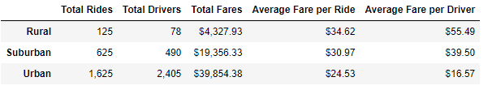
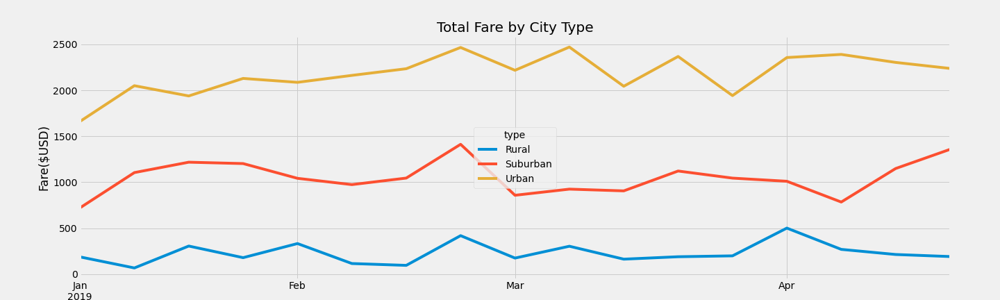

# PyBer Weekly Fares by City Type
Prepared by Robert Gallagher

## Overview

The purpose of this analysis is to look at total weekly fares by city type over a fixed time frame for PyBer rides.  The analysis was done using python.  See the link below to review the script.

[Python Script](Pyber_Challenge.ipynb)

The data source are provided csv files located here:

[City Data](Resources/city_data.csv)
[Ride Data](Resources/ride_data.csv)

## Results

- Summary of data by city type

- Comparison of city types
    - Total Rides: The urban city type has the most rides while rural has the least.  Suburbun has more than rural but still has a lot less than urban.
    - Total Drivers: Total drivers follows the same pattern as total rides above.
    - Total Fares: As can be expected from the info above the urban city has the most total fares.
    - Average Fare per Ride: Here we see that on average the most expensive riders are in rural locations and the least are in urban.
    - Average Fare per Driver: And similarly to average fare per ride the average fare per driver is also highest in rural locations and lowest in urban.

- Total weekly fares by city type:  This chart shows total weekly fares over several months.

## Summary

- As seen in the table above the urban city type has more drivers than total rides.  This implies that there a drivers in our list that are not actually providing any rides.  This is artificially lowering average fare per driver.  If we can reduce the number of drivers somewhat in the urban environment we may be able to increase both the average fare per ride and the average fare per driver.

- In all three environments there appears to be a spike in total fare per week in late February.  We should research what caused this and see if it is something we can replicate in other time periods.

- In general rural areas have significanly lower drivers and total rides.  This may be because of population density but it could also be caused by a lack of drivers.  We should research this and see if increasing rural drivers might increase total rides.

